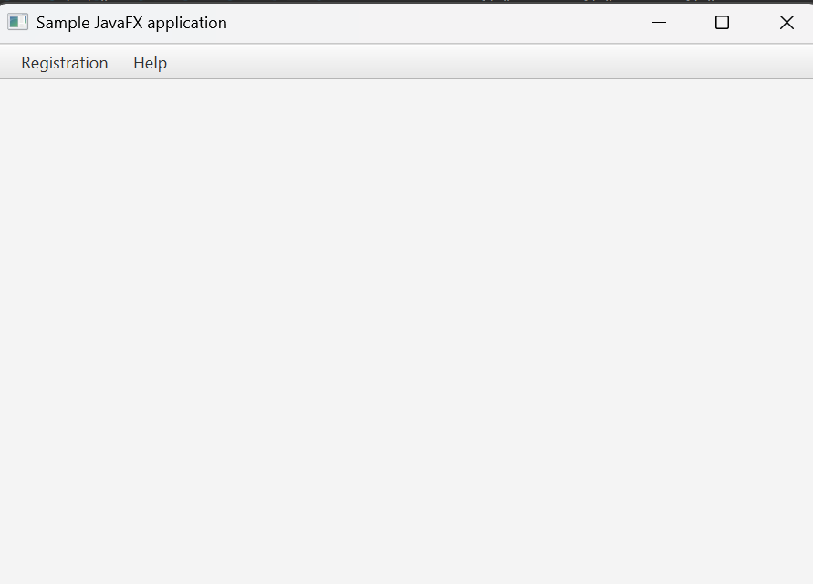
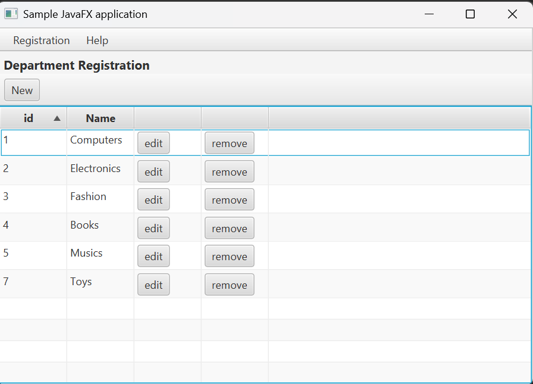
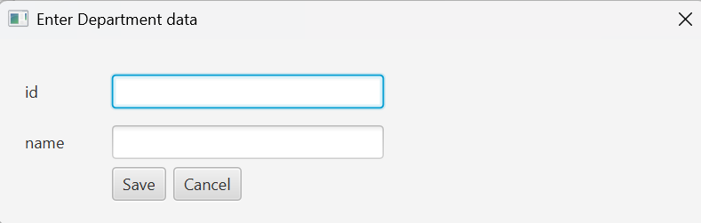
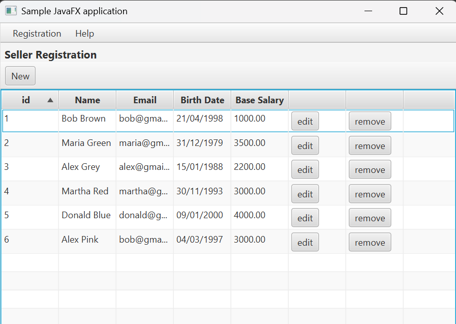
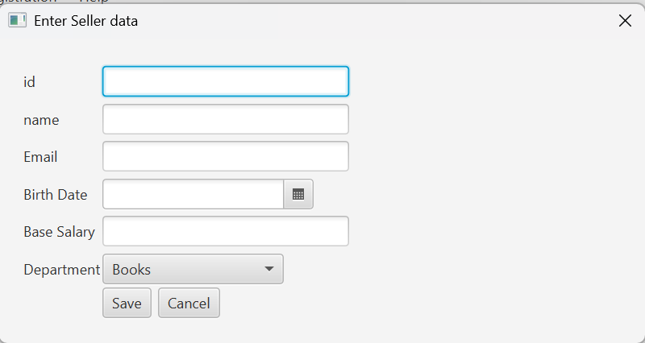
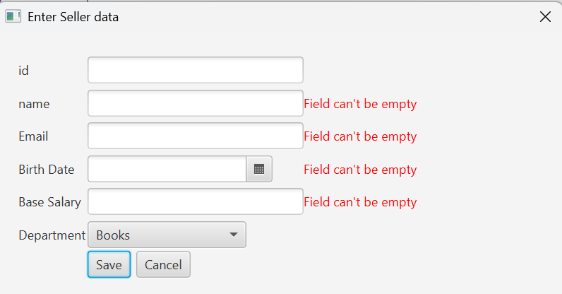
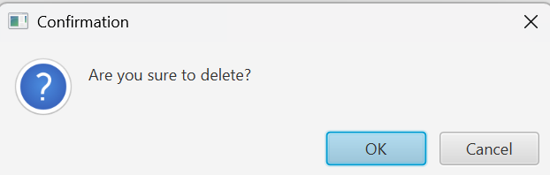

# Projeto JavaFX com JDBC

[](https://github.com/CarlosLacerda/Workshop-JavaFX-JDBC/blob/main/LICENSE)
[](https://www.oracle.com/java/technologies/javase-jdk22-downloads.html)
[](https://openjfx.io/)
[](https://www.mysql.com/products/community/)

## 📌 Descrição

Este projeto é parte do curso **Java Completo - Programação Orientada a Objetos + Projetos** (Prof. Nélio Alves). Ele apresenta uma aplicação desktop desenvolvida com **JavaFX** e integrada a um banco de dados **MySQL** via **JDBC**, utilizando o padrão **DAO** (Data Access Object) para operações CRUD (Create, Read, Update, Delete) com interface gráfica construída em **FXML**.

## 🎯 Objetivos

- Desenvolver uma aplicação desktop com **JavaFX**.
- Implementar acesso a banco de dados utilizando **JDBC**.
- Aplicar o padrão **DAO** para organização do código.
- Criar interfaces gráficas com **FXML** e **Controllers**.
- Implementar operações CRUD para gerenciamento de Departamentos e Vendedores.

## 🏗️ Tecnologias Utilizadas

- **Java 22.0.2**
- **JavaFX SDK** (versão compatível com o Java instalado)
- **MySQL** (banco de dados relacional)
- **MySQL Connector** (JDBC Driver)
- **Eclipse** ou **VS Code** como IDE

## 📂 Estrutura do Projeto

- `application`: Contém a classe `Main` que inicializa a aplicação JavaFX.
- `gui`: Arquivos `.fxml` e controllers (ex.: `MainViewController`, `DepartmentFormController`).
- `model.entities`: Entidades do modelo (`Department`, `Seller`).
- `model.dao`: Interfaces do padrão DAO.
- `model.dao.impl`: Implementações das interfaces DAO com JDBC.
- `db`: Classes para conexão com o banco e tratamento de exceções (`DbException`, `DbIntegrityException`).

## 🗄️ Funcionalidades

- Cadastro, edição e exclusão de **Departamentos**.
- Cadastro, edição e exclusão de **Vendedores**.
- Listagem de registros em **TableView**.
- Formulários com validação de campos.
- Botões para **Inserir**, **Editar** e **Remover** registros.
- Integração completa com banco de dados **MySQL**.

## 🚀 Como Executar

### Pré-requisitos

1. **Java 22** instalado.
2. **JavaFX SDK** configurado (variável `PATH_TO_FX` apontando para a pasta `/lib`).
3. **MySQL** ativo, com o banco de dados criado (script disponível no repositório base).
4. **MySQL Connector** adicionado à pasta `lib`.

### Executando pela IDE

1. Configure as VM options na IDE:
   ```
   --module-path %PATH_TO_FX% --add-modules javafx.controls,javafx.fxml
   ```
2. Execute a classe `application.Main`.

### Executando via JAR

1. Exporte o projeto como **Runnable JAR**.
2. Coloque na mesma pasta:
   - Arquivo `db.properties`.
   - **MySQL Connector**.
   - **JavaFX SDK**.
3. Execute o comando:
   ```bash
   java --module-path %PATH_TO_FX% --add-modules javafx.controls,javafx.fxml -cp myapp.jar application.Main
   ```

## 📦 Banco de Dados

O banco de dados contém as tabelas **Department** e **Seller**. O script de criação está disponível no repositório base:  
👉 [database.sql](https://github.com/acenelio/demo-dao-jdbc/blob/master/database.sql)

## 📸 Prints da Aplicação

### 1. Tela Inicial
Menu com opções "Registration" e "Help".  


### 2. Lista de Departamentos
Tabela com os departamentos cadastrados e botão **New**.  


### 3. Formulário de Departamento
Interface para cadastro e edição de departamentos.  


### 4. Lista de Vendedores
Tabela com vendedores mostrando ID, Nome, Email, Data de Nascimento e Salário.  


### 5. Formulário de Vendedor
Formulário para inserir ou editar vendedores, incluindo combobox para selecionar o departamento.  


### 6. Exemplo de Validação
Mensagem de erro exibida ao tentar salvar com campos inválidos ou vazios.  


### 7. Confirmação de Exclusão
Janela de confirmação exibida ao tentar remover um registro.  



## 📖 Referências

- [Projeto base (Prof. Nélio Alves)](https://github.com/acenelio/workshop-javafx-jdbc)

## 📜 Licença

Este projeto está licenciado sob a [MIT License](https://github.com/CarlosLacerda/workshop-javafx-jdbc/blob/main/LICENSE).

🔗 **Repositório deste projeto**: [Workshop-JavaFX-JDBC](https://github.com/CarlosLacerda/Workshop-JavaFX-JDBC.git)
.
